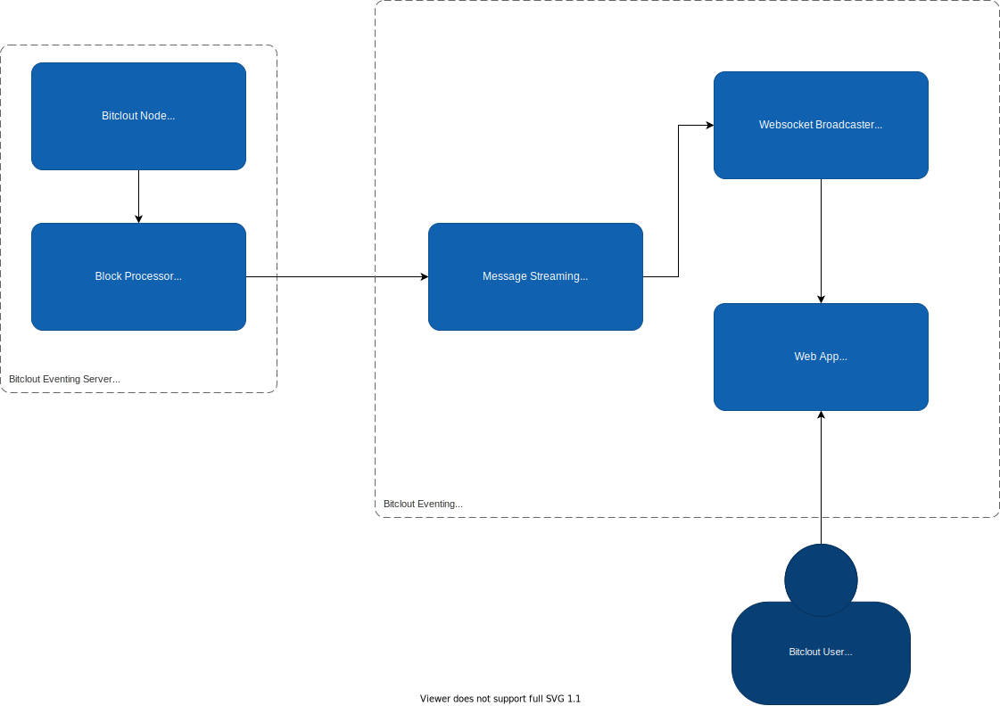

# BitcloutEvents
Event streaming for DeSo Blockchain

## Outcomes of this project:
- Send events from DeSo Blockchain node to an Azure based eventing service.
- Use of SignalR to then send the events to a web client over websocket.
- Implementation of an Azure Web App for the web application
- Do all of this as close to zero cost as possible

## Proposed Architecture

